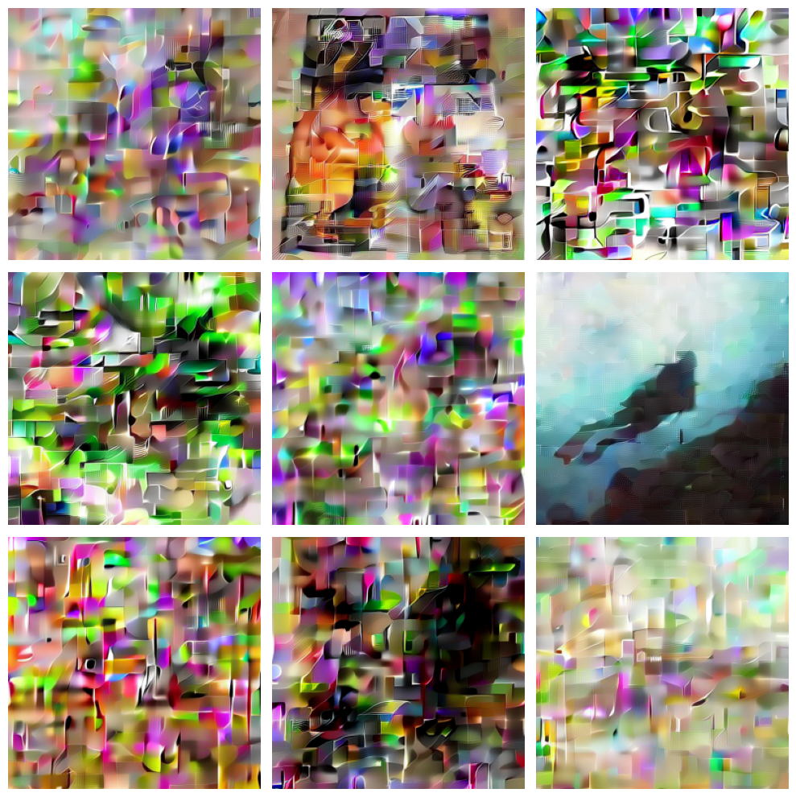

## dit_flow
**Training a diffusion transformer with flow matching**

This is a **minimal** example of **diffusion model(DiT) training** with **flow matching**, 
implemented in **JAX/Flax**.

#### sample

 \
*800 steps, single batch training, Imagenet, 350M param DiT*

#### credits
* [**Flow Matching Guide and Code**](https://arxiv.org/abs/2412.06264) => research paper.
* [**facebookresearch/flow_matching**](https://github.com/facebookresearch/flow_matching) => research codebase for flow matching (pytorch)
* [**Rami's dit-vs-unet**](https://github.com/SonicCodes/dit-vs-unet) => diffusion training implementation with JAX.